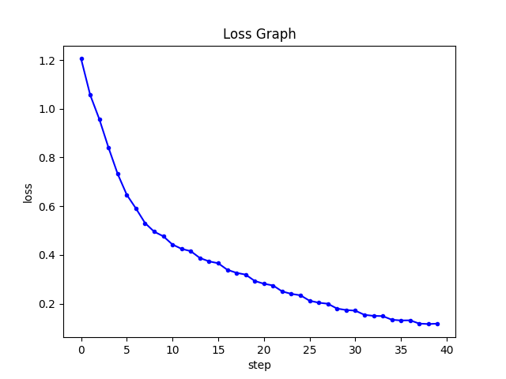

# Examples for Ivy AI - Unified Machine Learning

This repository contains examples for the Ivy AI - Unified Machine Learning library. When exploring the Ivy framework, I recognized that there are very few examples of how to use this framework for specific tasks. That's why I created this reposity to provide some working examples.

## I. Setup environment

- Python 3.8 is tested and recommended.
- Install nessessary packages with pip:

```
pip install -r requirements.txt
```

- Choose your backend in Tensorflow, PyTorch, Jax, or Numpy and install it. For example, for Pytorch:

```
pip install torch
```

## II. Run examples

### 1. Simple neural network example on Ivy documentation:

This is a simple example of a neural network with 2 hidden layers which I collected from the Ivy documentation.

- **Source:** [./train_simple_nn.py](./train_simple_nn.py)

```
python train_simple_nn.py
```

### 2. Iris classification:

Iris classification is a simple classification task. The dataset contains 150 samples of 3 different species of Iris (Iris setosa, Iris virginica and Iris versicolor). The dataset contains 4 features: sepal length, sepal width, petal length and petal width. The goal is to predict the species of Iris based on the features. Details: [https://archive.ics.uci.edu/ml/datasets/iris](https://archive.ics.uci.edu/ml/datasets/iris).

- **Source:** [./train_iris.py](./train_iris.py)
- **Accuracy:** 96.67%



```
python train_iris.py
```

### 3. MNIST digits classification:

MNIST is a simple classification task. The dataset contains ~7k images of handwritten digits. The goal is to predict the digit based on the image. Details: [http://yann.lecun.com/exdb/mnist/](http://yann.lecun.com/exdb/mnist/).


- **Source:** [./train_mnist.py](./train_mnist.py)
- **Accuracy:** 95.28%


```
python train_mnist.py
```
